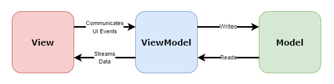

# What is MVVM?

The MVVM architecture is an industry-recognized software design pattern that separates the graphical user interface from the logic of an application. By separating the graphical user interface (i.e., the View) of the application from its backend logic, developers can decrease the likelihood that a change done to one part of their application will inadvertently impact another unrelated part. As the name suggests, the MVVM design patterns classifies each file into one of three categories: the Model, the View, and the ViewModel.  

## Model

The Model represents the objects in your application that are unrelated to the user interface (i.e., the View). The Model should not contain rendered UI elements or functions that modify or update the View. These are objects that represent data, access data, manipulate data, and perform validation checks. Examples of Model files include data transfer objects, data access objects, etc.  

## View

The View represents the user interface of the application and holds limited, purely presentational logic that renders UI elements. The View is completely agnostic to the backend logic of the application i.e., the View should not contain data declarations or manipulate the application's data directly. The View communicates UI events (i.e., the user interactions with the UI) to the ViewModel. The ViewModel in turn streams data that it acquired from the Model to the View.  

## ViewModel

The ViewModel is the link between the View and the Model. After being notified of UI events by the View, the ViewModel can write or update the Model. The ViewModel can also read data from the Model and pass it to the View for rendering.  

  

The diagram above summarizes the MVVM design architecture. Notice that the View and the Model do not communicate directly. All exchanges between the View and Model must go through the ViewModel.  
