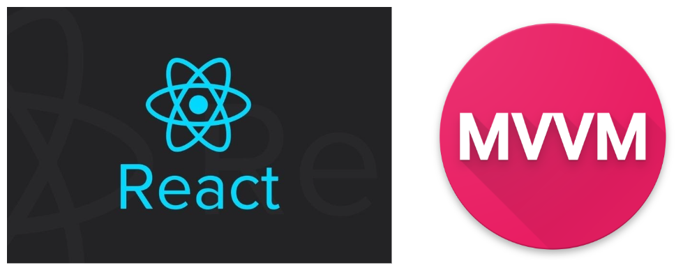
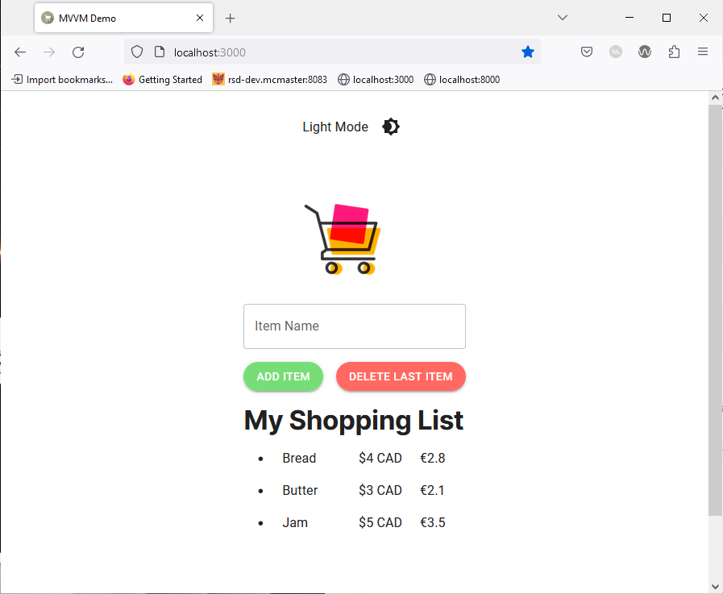

# Introduction to MVVM

  

_Image retrieved from [tech.groww.in](https://tech.groww.in/apply-mvvm-in-react-native-app-ad77fa0f851b)_  

The MVVM (Model-View-ViewModel) architecture is a software design pattern that aims to separate the graphical user interface from the functional logic and data of an application. Throughout this learning module, we will explore the benefits of using the MVVM architecture in a React-based (Next.js) webpage and its positive impact on code maintainability and readability. We will also guide participants through the process of modifying a simple demo application to make use of the MVVM architecture.  

## Initial Setup

Please follow these steps to install Node.js and create a Next.js application **before** starting the learning module.  

If you are using Windows or MacOS, use one of the installers from the [Node.js download page](https://nodejs.org/en/download/). Be sure to install the version labeled **LTS**. Other versions have not yet been tested with `npm`.  

If you are using a Linux distribution, you can install Node.js using the `apt` package manager.  
1. Start by refreshing your local package index:  
```bash
sudo apt update
```

2. Install Node.js:  
```bash
sudo apt install nodejs
```

3. Verify that the installation was successful: 
```bash
node -v
```
You should be presented with the version of Node.js that you just installed.  

4. Install the `npm` package manager:  
```bash
sudo apt install npm
```

### Clone the Next.js Demo SPA

Make sure you have Git installed on your system. If you need help installing Git on your system please consult the [official Git documentation](https://github.com/git-guides/install-git) or follow the [Introduction to Git and GitHub](https://ubc-library-rc.github.io/intro-git/) workshop provided by the UBC Library Research Commons.  

Once you have Node.js and Git installed, you can clone the demo SPA used in this workshop by opening a terminal window and running the following command:
```bash
git clone https://github.com/McMasterRS/lmr_mvvm.git
```

You will now have an `mvvm-demo` repo on your local machine.  

### Start the Development Server

1. `cd` into the your project directory:  
```bash
cd lmr_mvvm
```

2. Make sure you are on the `main` branch. If you are not on the main branch, you can switch to the main branch using the following command:  
```bash
git checkout main
```

3. Install `next` using the following command:  
```bash
npm i next
```

4. Start the development server:  
```bash
npm run dev
```

### View the the Single-Page Application

Open your browser of choice and navigate to `localhost:3000`.  

You should be presented with the following page:  


