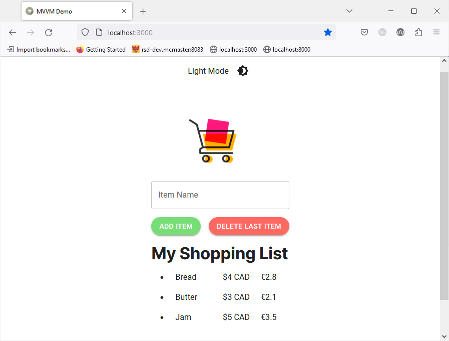

# Adding Functionality Using The ViewModel

We will now demonstrate how using a ViewModel can help you augment the functionality of your application without affecting the reusability of your View or modifying the data and Model.  

We want to update our application to display the price of each time in euros in addition to Canadian dollars. If we did not have a ViewModel, we would need to use one of the following two approaches:  
- **Add a `euro_price` field to our data**: This approach would force us to manually fill in the value of the field for all existing entries. We would also need to modify our Model to ensure that it fills in this field automatically for new entries. This solution is far from ideal since it requires modifying the data and Model, which can be relatively complex especially if your application is already in use by a large userbase.
- **Compute the euro price in the View**: We could compute the euro price in the View of our application before displaying it. However, this would mean adding additional code to the View in the form of a function, thus reducing the reusability of our View since it is now very specific to this page.

Alternatively, we can create a function that computes the euro price of each item given its original price and place it in the ViewModel. We would then import and use this function in the View, thus maintaining the separation between the logic and user interface of our application.  

## Add `getEuroPrice()` function

Start by adding the following import statement to `ItemViewModel.tsx`:  

```ts
import {Item} from "@/app/api/items/item";
```

Next, add the `getEuroPrice()` function to the `ItemViewModel` as shown below:  

```ts
const getEuroPrice = (item: Item) => {
	return Math.round(item.price * 0.69 * 10) / 10;
}
```

The function is relatively straightforward and computes the price of an item in euros rounded to 1 decimal place. We assume that $1 CAD = € 0.69.  

Finally, add the function to the return statement:  

```ts
return {
	itemName,
	items,
	handleChange,
	handleAddItem,
	handleDeleteItem,
	getEuroPrice,
}
```

## Import and Use `getEuroPrice()`

Open the `app/page.tsx` View file and add `getEuroPrice` to the constants imported from the `ItemViewModel`:  

```ts
const {
	itemName,
	items,
	handleChange,
	handleAddItem,
	handleDeleteItem,
	getEuroPrice,
} = ItemViewModel();
```

Add an additional `Grid` component to display the price in euros next to the original item price in CAD:  

```ts
<List sx={{ listStyleType: 'disc', pl: 4 }}>
	{items.map((item: Item) => (
		<ListItem sx={{ display: 'list-item' }} key={item.id}>
			<Grid container spacing={2}>
				<Grid item xs={5}>
					{item.name}
				</Grid>
				<Grid item xs={4}>
					{"$" + item.price + " CAD"}
				</Grid>
				<Grid item xs={3}>
					{"€" + getEuroPrice(item)}
				</Grid>
			</Grid>
		</ListItem>
	))}
</List>
```

Save the file and go back to your browser, the application should now look like this:  


We were able to add an additional layer of information to our application without modifying the structure of the data or impacting the reusability of our View. In the future, we can still reuse our View for another page or another web application because it does not include logic code specific to the use cases of our "Shopping List" SPA.  
